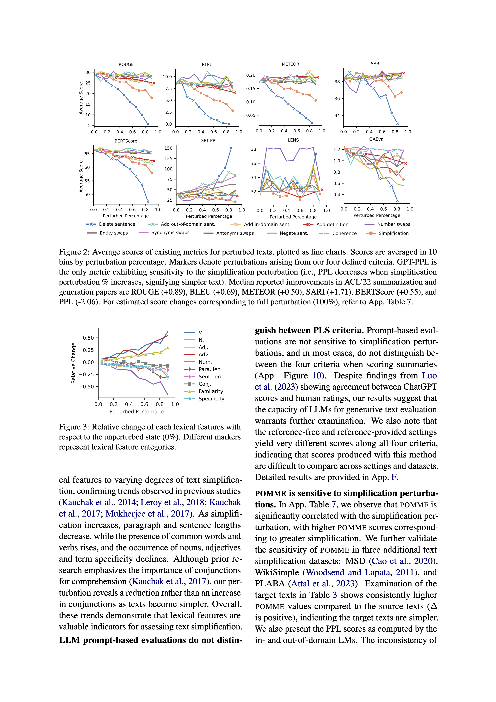
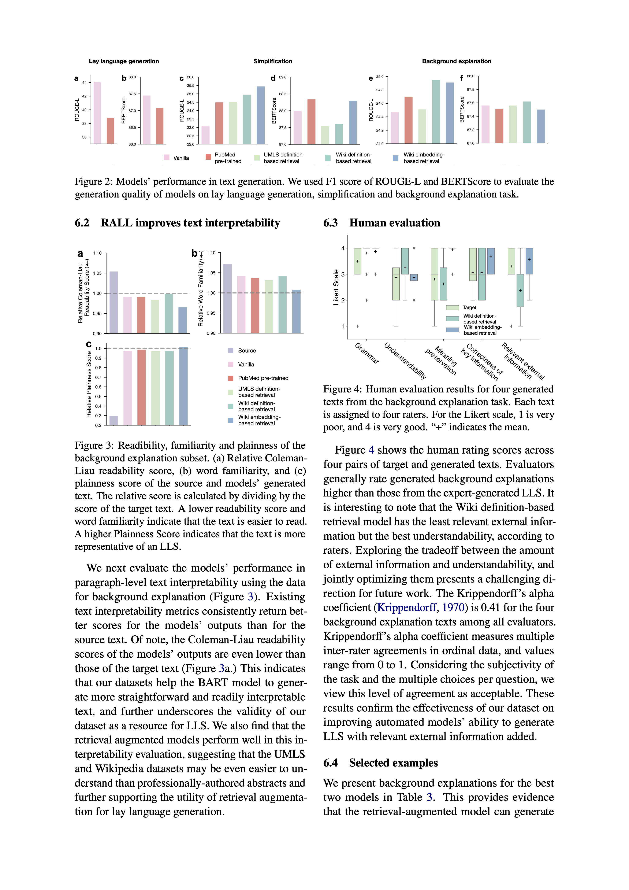
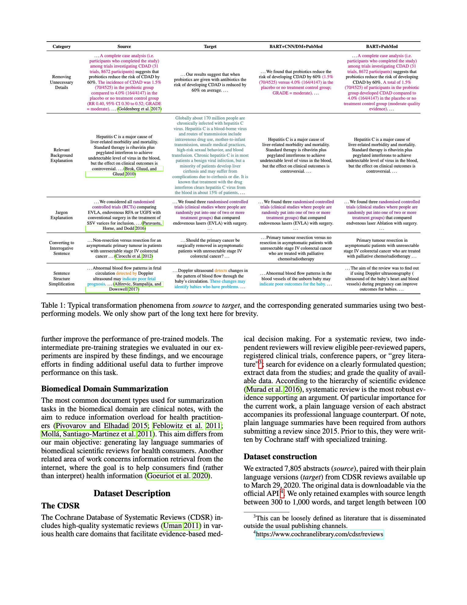
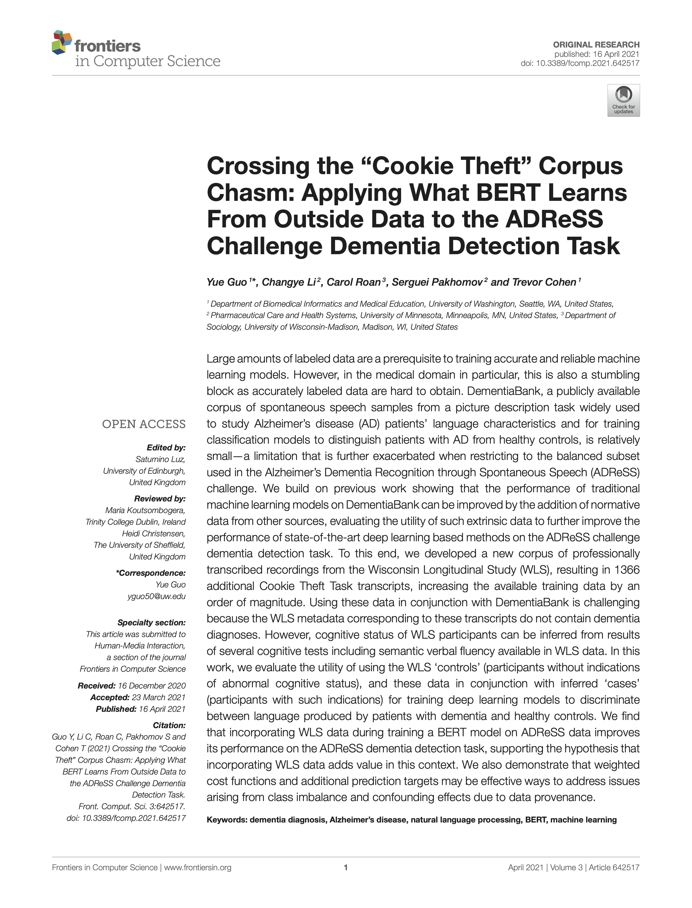
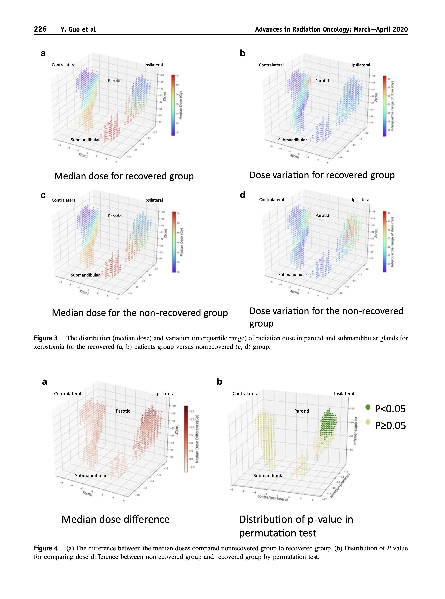

Welcome to Yue Guo (郭月)'s webpage! I am a final year Ph.D. student in [Biomedical and Health Informatics Department (BIME)](http://bime.uw.edu) at the University of Washignton, advised by Prof. [Trevor Cohen](http://bime.uw.edu/faculty/trevor-cohen/). I am particularly interested in **Natural Language Processing** and **Machine Learning** in medical domain.

Before coming to UW, I was a postdoctoral researcher of the Department of Radiation Oncology and Molecular Radiation Sciences at Johns Hopkins University School of Medicine, supervised by [Todd McNutt](https://www.hopkinsmedicine.org/profiles/details/todd-mcnutt). I received my Master of Health Science (MHS) from the Johns Hopkins Bloomberg School of Public Health, majoring in cancer Epidemiology. I got Bachelor of Medicine, Bachelor of Surgery (M.B.B.S) degree from Capital Medical University.

 I am in the job market and looking for AP positions!

News
======
<table style="width:100%; border: none; ">
    <tr>
        <td style="width: 50px; border: none; font-weight: bold;">May-30-23</td>
        <td style="border: none; font-size: 16px;">I commenced my internship with the <a href="https://www.semanticscholar.org/about">Semantic Scholar</a> team at the <a href="https://allenai.org">Allen Institute for AI (AI2)</a>!</td>
    </tr>
    <tr>
        <td style="width: 50px; border: none; font-weight: bold;">May-23-23</td>
        <td style="border: none; font-size: 16px;">New preprints available! <a href="https://arxiv.org/pdf/2305.14341.pdf">“APPLS: A Meta-evaluation Testbed for Plain Language Summarization"</a>. First work to controll perturbations in a plain language summarization dataset. We study 15 metrics, from automated metrics to lexical features to LLM-prompts. Turns out simplification is difficult for most metrics. POMME is our solution to this shortage of effective metrics! </td>
    </tr>
    <tr>
        <td style="width: 50px; border: none; font-weight: bold;">March-27-23</td>
        <td style="border: none; font-size: 16px;">I instructed the course BIME 591 D Sp 23, titled "Exploring the Applications of Large Language Models in Clinical Natural Language Processing."
</td>
    </tr>
</table>

Selected publications
======
<table style="width:100%; border: none; font-size: 16px;">
    <tr>
        <td style="width: 125px; border: none; font-weight: bold;"></td>
        <td style="border: none;">APPLS: A Meta-evaluation Testbed for Plain Language Summarization 
<strong>Yue Guo</strong>, Tal August, Gondy Leroy, Trevor Cohen, Lucy Lu Wang 
arXiv, May 2023
<a href="https://arxiv.org/pdf/2305.14341.pdf"><i class="fas fa-file-pdf"></i></a></td>
    </tr>
    <tr>
        <td style="width: 125px; border: none; font-weight: bold;"></td>
        <td style="border: none;">CELLS: A Parallel Corpus for Biomedical Lay Language Generation 
<strong>Yue Guo</strong>, Wei Qiu, Gondy Leory, Sheng Wang, Trevor Cohen 
arXiv, Nov 2022
<a href="https://arxiv.org/pdf/2211.03818.pdf"><i class="fas fa-file-pdf"></i></a></td>
    </tr>
    <tr>
        <td style="width: 125px; border: none; font-weight: bold;"></td>
        <td style="border: none;">Automated Lay Language Summarization of Biomedical Scientific Reviews 
<strong>Yue Guo</strong>, Wei Qiu, Yizhong Wang, Trevor Cohen  
the 35th AAAI conference in Artificial Intelligence, Feb 2021
<a href="https://ojs.aaai.org/index.php/AAAI/article/view/16089"><i class="fas fa-file-pdf"></i></a>
<a href="https://github.com/qiuweipku/Plain_language_summarization"><i class="fab fa-github"></i></a>
<i class="fas fa-play-circle"></i> </td>
    </tr>
    <tr>
        <td style="width: 125px; border: none; font-weight: bold;"></td>
        <td style="border: none;">Crossing the 'Cookie Theft' Corpus Chasm: Applying what BERT Learns from Outside Data to the ADReSS Challenge Dementia Detection Task 
<strong>Yue Guo</strong>, Changye Li, Carol Roan, Serguei Pakhomov, Trevor Cohen  
Frontiers in Computer Science, Apr 2021
<a href="https://www.frontiersin.org/articles/10.3389/fcomp.2021.642517/abstract"><i class="fas fa-file-pdf"></i></a></td>
    </tr>
    <tr>
        <td style="width: 125px; border: none; font-weight: bold;"></td>
        <td style="border: none;">Spatial Radiation Dose Influence on Xerostomia Recovery and Its Comparison to Acute Incidence in Head Neck Cancer Patients 
<strong>Yue Guo</strong>, Wei Jiang, Pranav Lakshminarayanan, Xuan Hui, Peijin Han, Zhi Cheng, Michale Bowers, Ilya Shpitser,Sauleh Siddiqui, Russell H Taylor, Harry Quon, Todd McNutt 
Advances in Radiation Oncology, March 2020
<a href="https://www.advancesradonc.org/action/showPdf?pii=S2452-1094%2819%2930122-8"><i class="fas fa-file-pdf"></i></a></td>
    </tr>
</table>

Presentations
======
The Feasibility of Outcome-Based Treatment Planning Strategy to Improve Xerostomia Symptom in Head and Neck Cancer Patients 
**Yue Guo**, Pranav Lakshminarayanan, Peijin Han, Khadija Sheikh, Zhi Cheng, Wei Jiang, Michael Bowers, SaulehSiddiqui, Ilya Shpitser, Russell H Taylor, Harry Quon, Todd McNutt 
International Journal of Radiation Oncology Biology Physics, 2019
[<i class="fas fa-file-pdf"></i>](https://www.redjournal.org/article/S0360-3016(19)31173-3/fulltext)

Evaluation of Patient vs. Provider Based Assessments of Xerostomia and Dysphagia Compared Against Weight Loss in the Irradiated Head and Neck Cancer Patient 
**Yue Guo**, Zhi Cheng, Emily Cecil, Pranav Lakshminarayanan, Yifei Lu, Peijin Han, Ana Kiess, Todd McNutt, Harry Quon 
International Journal of Radiation Oncology BiologyPhysics, 2019
[<i class="fas fa-file-pdf"></i>](https://www.redjournal.org/article/S0360-3016(19)32031-0/fulltext)

Voxel Dose Pattern for Patient-Reported Dysphagia among Head and Neck Cancer Patients Receiving Definitive Radiotherapy 
Zhi Cheng, Khadijia Sheikh, Pranav Lakshminarayanan, Wei Jiang, Peijin Han, **Yue Guo**, Emily Cecil, L Sloan,Ana Kiess, Brandi Page, Junhoon Lee, Harry Quon, Todd McNutt 
International Journal of RadiationOncology Biology Physics, 2019
[<i class="fas fa-file-pdf"></i>](https://www.redjournal.org/article/S0360-3016(19)30920-4/fulltext)

CV
======
Please see my cv <a href="https://yueguo-50.github.io/cv.pdf" target="_blank">here</a>. Feel free to contact me at yguo50@uw.edu.
